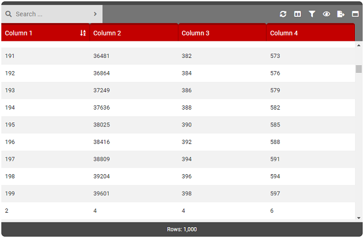

# JD-Table

> An advanced and flexible Vue.js 2.x component for displaying data tables. Feature rich and capable of handling big data, JD-Table was designed to integrate into applications with various needs.

<p align="center">
    <a href="https://www.npmjs.com/package/vue-jd-table"></a>
    <a href="https://www.npmjs.com/package/vue-jd-table"></a>
    
</p>

<p align="center">
  <br>
  
  <br>
</p>

### [View Demos](docs/Demos.md)

### Table of Contents

- [Features](#features)
- [Install](#install)
    - [NPM](#npm)
    - [Manual](#manual)
- [Usage](#usage)
    - [Initialize](#initialize)
        - [SFC](#sfc)
        - [Global](#global)
        - [Script](#script)
    - [Configure Options](docs/Options.md)
    - [Display Data](Data.md)
- [Properties](#properties)
- [Browser Support](#browser-support)
- [Polyfill](#polyfill)
- Documentation
    - [Options](docs/Options.md)
    - [Data](docs/Data.md)
    - [Status](docs/Status.md)
    - [Events](docs/Events.md)
        - [From Table](Events.md#JD-Table-Events-to-Your-App)
        - [From App](Events.md#Your-App-to-JD-Table-Events)
    - [Listeners](docs/Listeners.md)
    - [Theming](docs/Theming.md)

---

### Features
- Supports internal/external (API) data
- Traditional pagination
- Virtual scroll pagination
- Responsive/Fixed table sizing
- Responsive/Fixed column sizing
- Full-text search
- Column filtering
- Column selection
- Column views
- Column sorting
- Column resizing
- Left/Right click context menus
- Excel exportation
- Full screen/minimize
- Row 'Quick View'
- ... and more!

<p align="right">
    <a href="#table-of-contents">Back to Table of Contents</a>
</p>

---

### Install

##### NPM

```shell
npm install --save-dev vue-jd-table
npm install --save-dev @fortawesome/fontawesome-free
```

> Font Awesome (Free) is required for JD-Table. Failing to install this will result in missing icons.

##### Manual

1. Clone this repository or download and save these files to your project:

    - ./dist/**jd-table.min.js**
    - ./dist/**jd-table.min.css**

2. Instructions for manually installing Font Awesome (Free) can be found here: https://fontawesome.com/start

<p align="right">
    <a href="#table-of-contents">Back to Table of Contents</a>
</p>

---

### Usage

Follow all 3 steps below to begin using JD-Table.

1. [Initialize](#initialize)
2. [Configure Options](docs/Options.md)
3. [Display Data](docs/Data.md)

#### Initialize

Initializing includes 4 parts: Template, Vue Component, Options/Props and Theme. Below are a number of different ways to initialize JD-Tables depending on your needs.

###### SFC

The following is an example of how to use JD-Tables in a Vue SFC (single file component).

```vue
<template>
    <div id="app">
        <!-- JD-TABLE REQUIRED - TEMPLATE -->
        <JDTable
            :option                 = "tableOptions"
            :loader                 = "tableLoader"
            :event-from-app         = "eventFromApp"
            :event-from-app-trigger = "eventFromAppTrigger"
            @event-from-jd-table    = "processEventFromApp( $event )"
        />

        <!-- JD-TABLE REQUIRED - EXCEL EXPORT -->
        <iframe id="excelExportArea" style="display:none"></iframe>
    </div>
</template>

<script>
    // JD-TABLE REQUIRED - COMPONENT REGISTRATION
    import "@fortawesome/fontawesome-free/css/all.min.css";
    import JDTable from 'vue-jd-table';
    
    export default
    {
        name : 'MyApp',
        
        // JD-TABLE REQUIRED - COMPONENT REGISTRATION
        components:
        {
            JDTable
        },
        
        // JD-TABLE REQUIRED - OPTIONS/PROPS
        data ()
        {
            return {
                tableOptions        : { // ADD OPTIONS HERE },
                eventFromApp        : { name : null, data : null },
                eventFromAppTrigger : false,
                tableLoader         : false,
                columns             : [ // ADD COLUMNS HERE ]
            }
        }
    }
</script>

<style lang="scss">
    // JD-TABLE OPTIONAL - VARIABLE OVERRIDE

    // JD-TABLE REQUIRED - THEME
    @import "~vue-jd-table/dist/assets/jd-table.scss";
</style>
```

###### Global

The following registers JD-Table as a global component. Once registered, you can use the instructions above (SFC) to use and apply the component without having to import it each time.

```vue
import Vue     from 'vue';
import JDTable from 'vue-jd-table';

import "@fortawesome/fontawesome-free/css/all.min.css";
import 'vue-jd-table/dist/jd-table.min.css';

Vue.component( 'jdtable',JDTable );

new Vue
({
    ...
}).$mount( '#app' );
```

###### Script

The following shows an example of how to use JD-Table in your HTML files directly. You will require a polyfill for JD-Table.

```html
<!-- Polyfill -->
<script src="https://polyfill.io/v3/polyfill.js?features=es5,es6,es7&flags=gated"></script>

<!-- VueJS -->
<script src="https://cdn.jsdelivr.net/npm/vue/dist/vue.js"></script>

<!-- JD-Table Vue Component -->
<script src="vue-jd-table/dist/jd-table.min.js"></script>

<!-- JD-Table Styles -->
<link rel="stylesheet" href="vue-jd-table/dist/jd-table.min.css">

<!-- Font Awesome (Free) -->
<link rel="stylesheet" href="https://use.fontawesome.com/releases/v5.7.2/css/all.css" integrity="sha384-fnmOCqbTlWIlj8LyTjo7mOUStjsKC4pOpQbqyi7RrhN7udi9RwhKkMHpvLbHG9Sr" crossorigin="anonymous">

<div id="app">
    <JDTable
        :option                 = "tableOptions"
        :loader                 = "tableLoader"
        :event-from-app         = "eventFromApp"
        :event-from-app-trigger = "eventFromAppTrigger"
        @event-from-jd-table    = "processEventFromApp( $event )"
    />

    <iframe id="excelExportArea" style="display:none"></iframe>
</div>

<script type="text/javascript">
    new Vue
    ({
        el : '#app',
        
        components:
        {
            JDTable
        },
        
        data ()
        {
            return {
                tableOptions        : { // ADD OPTIONS HERE },
                eventFromApp        : { name : null, data : null },
                eventFromAppTrigger : false,
                tableLoader         : false,
                columns             : [ // ADD COLUMNS HERE ]
            }
        },
        
        ...
    });
</script>
```

#### Configure Options

[Dedicated Page - Click Here](docs/Options.md)

#### Display Data

[Dedicated Page - Click Here](docs/Data.md)

<p align="right">
    <a href="#table-of-contents">Back to Table of Contents</a>
</p>

---

### Properties

JD-Table accepts the following props/properties:

- **option** [Object]
    - An object containing key/value pairs representing the options/settings for the table. Check out the [options](docs/Options.md) to learn more about the available choices.
- **loader** [Boolean]
    - A true/false setting which will enable or disable a loading message in the JD-Table. Use this while waiting to get a response from a REST call for data.
- **event-from-app**  [Object]
    - An object containing two keys "name" (string) and "payload" (string/object). Use this to send events to JD-Table such as sending data. Learn more about how to send events and what is available [here](docs/Events.md).
- **event-from-app-trigger** [Boolean]
    - A true/false setting which tells JD-Table to execute a event-from-app event. Learn more about triggering events [here](docs/Events.md).
- **event-from-jd-table** [Event/Function/Callback]
    - An event that is triggered using a Vue $emit call. Learn more about how to process these events [here](docs/Events.md).

<p align="right">
    <a href="#table-of-contents">Back to Table of Contents</a>
</p>

---

### Browser Support

JD-Table runs in all modern browsers. IE11 is supported so long as a polyfill is provided. See the [polyfill](#polyfill) section for more details.

<p align="right">
    <a href="#table-of-contents">Back to Table of Contents</a>
</p>

---

### Polyfill

JD-Table is written with ES5/6 functionality. Take note that the build module for JDTable *does not include* a polyfill. If you need support for legacy browsers like IE 11 you will need to inject a polyfill
service.

> **Reminder**: Typically build processes like Webpack & Vue-CLI do **NOT** add polyfill's to your imported **dependencies** (it will polyfill your app but not the JDTable dependency).

##### Polyfill Solution #1

For build processes like Webpack/Vue-CLI, rather than importing the component normally, import the .VUE file directly. If your project already includes polyfill's it will be processed normally.

```
import JDTable from 'vue-jd-table/src/jd-table.vue';
```

##### Polyfill Solution #2

For Vue-CLI specifically, create/add the following to vue.config.js. This will tell Vue-CLI to polyfill the normally imported JD-Table module.

vue.config.js
```
module.exports =
{
    transpileDependencies : ['vue-jd-table']
};
```

#### Polyfill Solution #3

Using babel and babel-polyfill, directly add polyfill's to your dependency's.

babel.config.js
```
module.exports =
{
    presets:
    [
        ['env',
        {
            polyfills :
            [
                'es6.promise',
                'es6.object.assign',
                'es6.function.name',
                'es6.array.find',
                'es6.array.find-index',
                'es7.array.includes',
                'es6.string.includes'
            ]
        }]
    ]
}
```

<p align="right">
    <a href="#table-of-contents">Back to Table of Contents</a>
</p>
