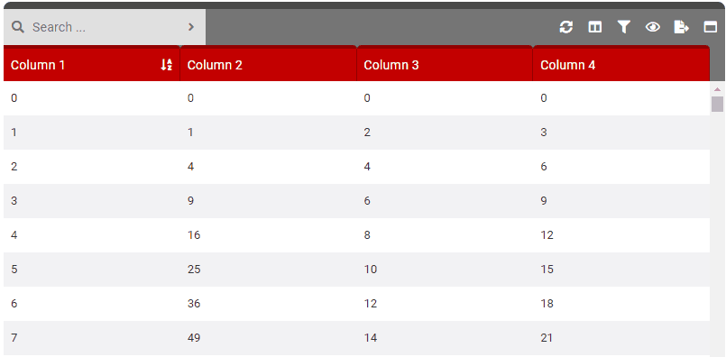
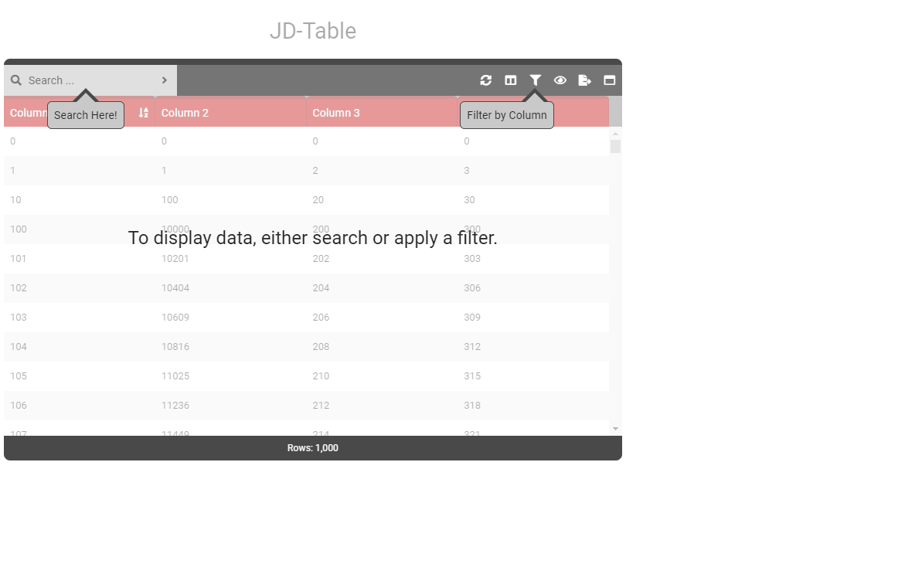
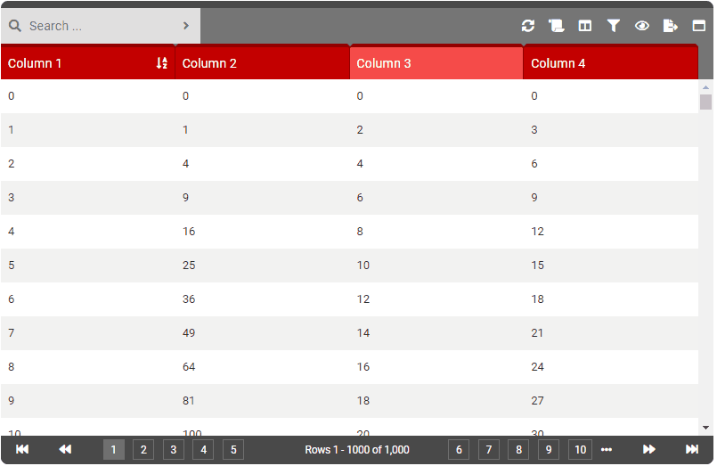
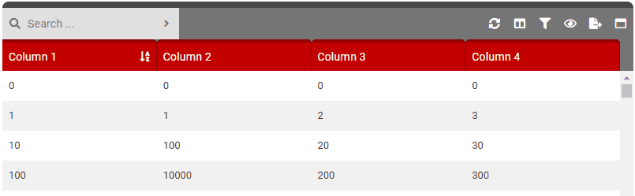
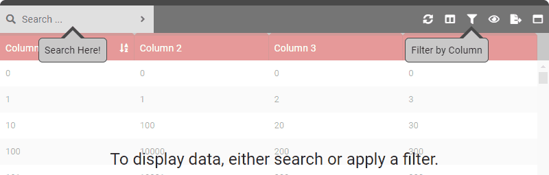

# JD-Table / Options

#### Options

Below is a list of options that can be passed to JD-Table via the **option** property.

```javascript
...

<JDTable
    :option                 = "tableOptions" // <---- PASS OPTIONS HERE!
    :loader                 = "tableLoader"
    :event-from-app         = "eventFromApp"
    :event-from-app-trigger = "eventFromAppTrigger"
    @event-from-jd-table    = "processEventFromApp( $event )"
/>

...

data ()
{
    return {
        tableOptions : { // OPTIONS HERE \\ }
    }
}
```

### Table of Contents

- [columns](#columns)
- [columnSelect](#columnSelect)
- [columnSort](#columnSort)
- [controls](#controls)
- [dataHeight](#dataHeight)
- [dataprovider](#dataprovider)
- [export](#export)
- [exportLimit](#exportLimit)
- [filter](#filter)
- [footer](#footer)
- [forceMaximized](#forceMaximized)
- [forceSearchOpen](#forceSearchOpen)
- [frameWidth](#frameWidth)
- [headerHeight](#headerHeight)
- [highlight](#highlight)
- [maxMinimize](#maxMinimize)
- [pageSideQuantity](#pageSideQuantity)
- [paginationRowAll](#paginationRowAll)
- [paginationRowLimits](#paginationRowLimits)
- [paginationRowStart](#paginationRowStart)
- [quickView](#quickView)
- [contextMenu](#contextMenu)
- [contextMenuView](#contextMenuView)
- [contextMenuEdit](#contextMenuEdit)
- [contextMenuDelete](#contextMenuDelete)
- [contextMenuAdd](#contextMenuAdd)
- [addNew](#addNew)
- [viewItem](#viewItem)
- [editItem](#editItem)
- [deleteItem](#deleteItem)
- [refresh](#refresh)
- [renderEngine](#renderEngine)
- [resize](#resize)
- [resizeForceMinWidth](#resizeForceMinWidth)
- [responsiveFrame](#responsiveFrame)
- [responsiveFrameForceFullWidth](#responsiveFrameForceFullWidth)
- [responsiveTable](#responsiveTable)
- [rowFlex](#rowFlex)
- [rowHeight](#rowHeight)
- [rowZebra](#rowZebra)
- [search](#search)
- [startBySearch](#startBySearch)
- [startBySearchMessage](#startBySearchMessage)
- [startBySearchArrowFilter](#startBySearchArrowFilter)
- [startBySearchArrowFilterText](#startBySearchArrowFilterText)
- [startBySearchArrowSearch](#startBySearchArrowSearch)
- [startBySearchArrowSearchText](#startBySearchArrowSearchText)
- [searchPlaceHolder](#searchPlaceHolder)
- [startMaximized](#startMaximized)
- [title](#title)
- [views](#views)
- [virtualEngineRowStart](#virtualEngineRowStart)

---

- ##### columns

    - **Type**: [Array]
    <br><br>
    -  **Default**: []
    <br><br>
    - **Details**: An array of objects which represent each column (and their settings). A minimum of one column must be defined.
    <br><br>
    - **Column Object Settings**:
        - **name** [String]: Internal name of the column. Must contain only letters (no spaces). **Required**.
        - **title** [String]: Display title of the column. This is what will be displayed to the user in the column heading. **Required**.
        - **width** [Number]: The width of the column. The unit of this value depends on the table option **responsiveTable**. This option is optional when **responsiveTable** is set to TRUE as width will be equally distributed. However, it is required when **responsiveTable** is set to FALSE as hard coded width's are necessary.
            - **responsiveTable** [TRUE]: Width units will be used as %.
            - **responsiveTable** [FALSE]: Width units will be used as PX.
        - **order** [Number]: Indicates the order that the column will be displayed in from left to right, one (1) being the first (left-most) column. **Required**.
        - **sort** [Boolean]: Indicates if this is the column that should be initially sorted on when displaying results.
        - **sortDirection** [String]: Indicates the direction of the sort: '**asc**' or '**desc**'.
        - **sortSpecial** [String]: Indicates special sort options.
            - **Custom Sort Options**:
                - **IP**: Sorts string and array types according to how a human would read sorted IP's. In the case of an array of IP's the first element of each item is sorted.
        - **type** [String]: Indicates the type of data that is in this column: '**String**', '**Number**' or '**Array**'.
        - **filterable** [Boolean]: Determines if this column can be filterable. **Required**.
        - **enabled** [Boolean]: Determines if the column is initally visible in the table. Set to FALSE to hide the column. Users can later add the column into the view by enabling it in using the columns feature. **Required**.
    <br><br>        
        > **Note**: Columns of type **Array** can be a array of strings or numbers only ( numbers will be cast as strings for search ). Array columns will appear as a list in the row of data and be fully searchable. When sorting a column that is of type array, the data will be sorted by the first item of the array for each row.
    <br><br>
    - **Example**:
    
    ```javascript
    data ()
    {
        return {
            tableOptions :
            {
                columns :
                [
                    {
                        name          : 'businessName',
                        title         : 'Business Name',
                        width         : 200,
                        order         : 1,
                        type          : 'String',
                        sort          : true,
                        sortDirection : 'asc',
                        filterable    : true,
                        enabled       : true
                    },
                    {
                        name       : 'ownerName',
                        title      : 'Owner',
                        width      : 150,
                        order      : 2,
                        type       : 'String',
                        filterable : true,
                        enabled    : true
                    },
                    {
                        name       : 'ownerAge',
                        title      : 'Age',
                        width      : 60,
                        order      : 3,
                        type       : 'Number',
                        filterable : true,
                        enabled    : false
                    }
                ]
            }
        }   
    }
    ```
    
<p align="right">
    <a href="#table-of-contents">Back to Table of Contents</a>
</p>
    
- ##### columnSelect

    - **Type**: [Boolean]
    <br><br>
    -  **Default**: True
    <br><br>
    - **Details**: Controls the column selection feature. This allows users to show/hide columns in the table.
    <br><br>
    - **Options**:
        - True: Enables the column selection button in the control bar.
        - False: Disables the column selection button in the control bar.
    <br><br>
    - **Example**:
    
    ```javascript
    data ()
    {
        return {
            tableOptions :
            {
              columnSelect : true
            }
        }
    }
    ```
    
    <p align="center">
      
      <br>
    </p>

<p align="right">
    <a href="#table-of-contents">Back to Table of Contents</a>
</p>

- ##### columnSort

    - **Type**: [Boolean]
    <br><br>
    -  **Default**: True
    <br><br>
    - **Details**: Controls the ability for users to sort data by column. When enabled, clicking a column header will sort the dataset in the ascending order. Clicking a second time will sort the data by descending order.
    <br><br>
    - **Options**:
        - True: Enables columns to be clicked which will sort data.
        - False: Disables column sorting.
    <br><br>
    - **Example**:
    
    ```javascript
    data ()
    {
        return {
            tableOptions :
            {
              columnSort : true
            }
        }
    }
    ```

<p align="right">
    <a href="#table-of-contents">Back to Table of Contents</a>
</p>

- ##### controls

    - **Type**: [Boolean]
    <br><br>
    -  **Default**: True
    <br><br>
    - **Details**: Renders the control bar or not. This must be enabled to use any control bar feature.
    <br><br>
    - **Options**:
        - True: Enables the control bar.
        - False: Disables the control bar.
    <br><br>
    - **Example**:
    
    ```javascript
    data ()
    {
        return {
            tableOptions :
            {
              controls : true
            }
        }
    }
    ```

<p align="right">
    <a href="#table-of-contents">Back to Table of Contents</a>
</p>

- ##### dataHeight

    - **Type**: [Number]
    <br><br>
    -  **Default**: 400
    <br><br>
    - **Details**: A number value (PX) which will applied to the data table body height. Null = 100%.
    <br><br>
    - **Example**:
    
    ```javascript
    data ()
    {
        return {
            tableOptions :
            {
              dataHeight : 500
            }
        }
    }
    ```

<p align="right">
    <a href="#table-of-contents">Back to Table of Contents</a>
</p>

- ##### dataProvider

    - **Type**: [Number]
    <br><br>
    -  **Default**: 0
    <br><br>
    - **Details**: Indicates how data will be provided. This setting determines how most table functionality will operate. Typically this setting will be determined by how much data you need to display/process. When working with small amounts of data such as 5,000 rows or less you can most likely send the entirety of the data to JD-Table to manage and display. This could be done using a single REST API call and sending the parsed JSON result to JD-Table. In this scenario, JD-Table will handle search, filtering, sorting, pagination, etc. all by itself.<br><br>On the other hand, if you have big data such as anything higher than 5,000 rows (including millions or billions) then you will typically want to load (request) the data necessary to display to a user as it is needed. Option **1** of this setting will change any data manipulating function (searching, filtering, pagination, sorting, etc.) to a $emit event in Vue. This allows you to design the necessary API calls for each action individually. Setting this option to **1** is certainly more complex to configure for but the payoff of being able to present a data table with millions of rows of data behind it is worth it!
    <br><br>
    
    > JD-Table does not implement any REST API calls on your behalf. Instead, all data requests must be designed by you. The primary reason for this is that there is such a wide variety of API's schema's out there.
    <br>
    
    - **Options**:
        - 0: All data will be injected to the JD-Table component via a *from app* event. All table functionality such as search, filtering, sorting, etc. will be processed by the JD-Table component.
        - 1: Partial data will be provided by the app (normally via a external API) and injected to the JD-Table component via a *from app* event. All table functionality such as search, filtering, sorting, pagination, etc. will be handled via the application (JD-Table will emit events for all these actions).
    <br><br>
    - **Example**:
    
    ```javascript
    data ()
    {
        return {
            tableOptions :
            {
              dataProvider : 0
            }
        }
    }
    ```

<p align="right">
    <a href="#table-of-contents">Back to Table of Contents</a>
</p>

- ##### export

    - **Type**: [Boolean]
    <br><br>
    -  **Default**: True
    <br><br>
    - **Details**: Controls the excel export feature on the control bar. Using this button will export the current data set to an excel file and download to the user.
    <br><br>
    - **Related Options**: exportLimit
    <br><br>
    - **Options**:
        - True: Enables the excel export feature on the control bar.
        - False: Disables the excel export feature on the control bar.
    <br><br>
    - **Example**:
    
    ```javascript
    data ()
    {
        return {
            tableOptions :
            {
              export : true
            }
        }
    }
    ```
    
    **IMPORTANT**
    > In order for excel import to operate properly you must add the following iFrame HTML code somewhere on your page.
    
    ```html
    <iframe id="excelExportArea" style="display:none"></iframe>
    ```

<p align="right">
    <a href="#table-of-contents">Back to Table of Contents</a>
</p>

- ##### exportLimit

    - **Type**: [Number]
    <br><br>
    -  **Default**: Null (All)
    <br><br>
    - **Details**: Sets a restriction on how many records can be exported via Excel. This is a good idea if you displaying a big dataset. Since the export process is done via JavaScript (in-browser) you could have performance issues if you try to export a lot of rows with many columns (10,000 +).
    <br><br>
    - **Related Options**: export
    <br><br>
    - **Example**:
    
    ```javascript
    data ()
    {
        return {
            tableOptions :
            {
              export : true,
              exportLimit : 5000
            }
        }
    }
    ```

<p align="right">
    <a href="#table-of-contents">Back to Table of Contents</a>
</p>

- ##### filter

    - **Type**: [Boolean]
    <br><br>
    -  **Default**: True
    <br><br>
    - **Details**: Controls the filter feature on the control bar. This allows users to select one or more columns and apply filters to them to limit the data they wish to view.<br><br>The available filters depend on the column type (set in the column settings). String based columns have 'Equals To', 'Contains', 'Not Equals To' and 'Begins With' filters. Number columns add 'Greater/Equal To' and 'Less/Equal To' filters.<br><br>If a search is active, filtering occurs after - meaning filtering is applied to the searched results (not the entire dataset). If there is no search active, the entire dataset will be filtered.<br><br>Filters are applied using the following logic:
        - More than one filter applied to the same column are grouped together and use the OR operator between them.
            - Filter #1: 'Column1' --> 'Equals To' --> 'John'
            - Filter #2: 'Column1' --> 'Equals To' --> 'Peter'
            - **Applied: Show rows where 'Column1' --> 'Equals To' --> 'John' OR 'Peter'**
        - More than one filter applied to different columns use the AND operator between them.
            - Filter #1: 'Column1' --> 'Equals To' --> 'John'
            - Filter #2: 'Column2' --> 'Equals To' --> '$100.00'
            - **Applied: Show rows where 'Column1' --> 'Equals To' --> 'John' AND 'Column2'**
    <br><br>
    - **Options**:
        - True: Enables the filtering button on the control bar.
        - False: Disables the filtering button on the control bar.
    <br><br>
    - **Example**:
    
    ```javascript
    data ()
    {
        return {
            tableOptions :
            {
              filter : true
            }
        }
    }
    ```
    
    <p align="center">
      
      <br>
    </p>

<p align="right">
    <a href="#table-of-contents">Back to Table of Contents</a>
</p>

- ##### footer

    - **Type**: [Boolean]
    <br><br>
    -  **Default**: True
    <br><br>
    - **Details**: Renders the footer. Must be true for pagination.
    <br><br>
    - **Options**:
        - True: Enables the footer bar.
        - False: Disables the footer bar.
    <br><br>
    - **Example**:
    
    ```javascript
    data ()
    {
        return {
            tableOptions :
            {
              footer : true
            }
        }
    }
    ```

<p align="right">
    <a href="#table-of-contents">Back to Table of Contents</a>
</p>

- ##### forceMaximized

    - **Type**: [Boolean]
    <br><br>
    -  **Default**: False
    <br><br>
    - **Details**: Forces JD-Table to stay maximized (users cannot minimize).
    <br><br>
    - **Options**:
        - True: Forces maximized state.
        - False: Allows for user to control the maximized state.
    <br><br>
    - **Example**:
    
    ```javascript
    data ()
    {
        return {
            tableOptions :
            {
              forceMaximized : true
            }
        }
    }
    ```

<p align="right">
    <a href="#table-of-contents">Back to Table of Contents</a>
</p>

- ##### forceSearchOpen

    - **Type**: [TYPEHERE]
    <br><br>
    -  **Default**: False
    <br><br>
    - **Details**: Controls the visibility of the search box. By default the search box will be hidden until the user clicks the search button. With this option you can force it open all the time.
    <br><br>
    - **Options**:
        - True: Forces the search box to be visible all the time.
        - False: The search box will be hidden until the users presses the search button.
    <br><br>
    - **Example**:
    
    ```javascript
    data ()
    {
        return {
            tableOptions :
            {
              forceSearchOpen : true
            }
        }
    }
    ```

<p align="right">
    <a href="#table-of-contents">Back to Table of Contents</a>
</p>

- ##### frameWidth

    - **Type**: [Number]
    <br><br>
    -  **Default**: Null
    <br><br>
    - **Details**: A number value (PX) which will be assigned to the width of JD-Table when responsiveFrame is set to False.
    <br><br>
    - **Related Options**: responsiveFrame
     <br><br>
    - **Example**:
    
    ```javascript
    data ()
    {
        return {
            tableOptions :
            {
              frameWidth : 1250
            }
        }
    }
    ```

<p align="right">
    <a href="#table-of-contents">Back to Table of Contents</a>
</p>

- ##### headerHeight

    - **Type**: [Number]
    <br><br>
    -  **Default**: 40
    <br><br>
    - **Details**: A number value (PX) which will applied to the table header row height.
    <br><br>
    - **Example**:
    
    ```javascript
    data ()
    {
        return {
            tableOptions :
            {
              headerHeight : 55
            }
        }
    }
    ```

<p align="right">
    <a href="#table-of-contents">Back to Table of Contents</a>
</p>

- ##### highlight

    - **Type**: [Boolean]
    <br><br>
    -  **Default**: True
    <br><br>
    - **Details**: Renders the top highlight bar on the frame.
    <br><br>
    - **Options**:
        - True: Enable top highlight bar on JD-Table.
        - False: Disable top highlight bar on JD-Table.
    <br><br>
    - **Example**:
    
    ```javascript
    data ()
    {
        return {
            tableOptions :
            {
              highlight : true
            }
        }
    }
    ```

<p align="right">
    <a href="#table-of-contents">Back to Table of Contents</a>
</p>
 
- ##### maxMinimize

    - **Type**: [Boolean]
    <br><br>
    -  **Default**: True
    <br><br>
    - **Details**: Controls the min/maximize feature button. Maximizing JD-Table will cause it to take over the entire browser/frame window.
    <br><br>
    - **Options**:
        - True: Enables the maximize/minimize button in the control bar.
        - False: Disables the maximize/minimize button in the control bar.
    <br><br>
    - **Example**:
    
    ```javascript
    data ()
    {
        return {
            tableOptions :
            {
              NAMEHERE : true
            }
        }
    }
    ```
    
    <p align="center">
      
      <br>
    </p>

<p align="right">
    <a href="#table-of-contents">Back to Table of Contents</a>
</p>

- ##### pageSideQuantity

    - **Type**: [Number]
    <br><br>
    -  **Default**: 5
    <br><br>
    - **Details**: The number of page choices that will be available on either side of the row display on the footer. Only applies when renderEngine is set to (2) for pagination.
    <br><br>
    - **Example**:
    
    ```javascript
    data ()
    {
        return {
            tableOptions :
            {
              pageSideQuantity : 3
            }
        }
    }
    ```

<p align="right">
    <a href="#table-of-contents">Back to Table of Contents</a>
</p>

- ##### paginationRowAll

    - **Type**: [Boolean]
    <br><br>
    -  **Default**: True
    <br><br>
    - **Details**: Controls the "All" option for pagination when renderEngine is set to (2). Selecting "All" will force all data in the dataset to be rendered in the view. It is recommended to disable (false) this setting when your table will be working with a lot of data to prevent performance issues.
    <br><br>
    - **Options**:
        - True: Will enable the "All" option in the pagination row options.
        - False: Will disable the "All" option in the pagination row options.
    <br><br>
    - **Example**:
    
    ```javascript
    data ()
    {
        return {
            tableOptions :
            {
              paginationRowAll : false
            }
        }
    }
    ```

<p align="right">
    <a href="#table-of-contents">Back to Table of Contents</a>
</p>

- ##### paginationRowLimits

    - **Type**: [Array]
    <br><br>
    -  **Default**: [20, 50, 100]
    <br><br>
    - **Details**: Array of numbers that will be provided as options for how many rows appear per page (pagination engine).
    <br><br>
    - **Example**:
    
    ```javascript
    data ()
    {
        return {
            tableOptions :
            {
              paginationRowLimits : [100,150,200]
            }
        }
    }
    ```
    
    <p align="center">
      
      <br>
    </p>

<p align="right">
    <a href="#table-of-contents">Back to Table of Contents</a>
</p>

- ##### paginationRowStart

    - **Type**: [Number]
    <br><br>
    -  **Default**: 20
    <br><br>
    - **Details**: A number that will be used as the default selection for how many rows to appear per page (pagination engine). This number should be one of the values in the paginationRowLimits option. 
    <br><br>
    - **Example**:
    
    ```javascript
    data ()
    {
        return {
            tableOptions :
            {
              paginationRowStart : 150
            }
        }
    }
    ```

<p align="right">
    <a href="#table-of-contents">Back to Table of Contents</a>
</p>

- ##### quickView

    - **Type**: [Boolean]
    <br><br>
    -  **Default**: 1
    <br><br>
    - **Details**: Controls the ability to click or double click a row to see the Quick View. This is a good idea to enable when you may have many, many columns of data but only disable a handful in the actual table. Configure this setting to 1 (single click) or 2 (double click) to the row and it will allow the user to view all the row data (even on columns that are currently selected as hidden).
    <br><br>
    - **Options**:
        - 0: Diables quick view.
        - 1: Quick view appears on single (left) click.
        - 2: Quick view appears on double (left) click.
    <br><br>
    > **Note**: When contextMenuLeft is enabled, it will superseed this setting.
    <br><br>
    - **Example**:
    
    ```javascript
    data ()
    {
        return {
            tableOptions :
            {
              quickView : true
            }
        }
    }
    ```
    
    <p align="center">
      
      <br>
    </p>

<p align="right">
    <a href="#table-of-contents">Back to Table of Contents</a>
</p>

- ##### contextMenuLeft

    - **Type**: [Boolean]
    <br><br>
    -  **Default**: False
    <br><br>
    - **Details**: Controls the ability to show a left click (context menu) when the user right clicks on a row. Available options for the context menu include View and Edit controllable with their own options contextMenuView and contextMenuEdit.
    <br><br>
    - **Options**:
        - True: Enables the left click context menu.
        - False: Disables the left click context menu.
    <br><br>
    > **Note**: When this setting is enabled, it will superseed the quickMenu setting.
    <br><br>
    - **Example**:
    
    ```javascript
    data ()
    {
        return {
            tableOptions :
            {
              contextMenu : true
            }
        }
    }
    ```

<p align="right">
    <a href="#table-of-contents">Back to Table of Contents</a>
</p>

- ##### contextMenuRight

    - **Type**: [Boolean]
    <br><br>
    -  **Default**: False
    <br><br>
    - **Details**: Controls the ability to show a right click (context menu) when the user right clicks on a row. Available options for the context menu include View and Edit controllable with their own options contextMenuView and contextMenuEdit.
    <br><br>
    - **Options**:
        - True: Enables the right click context menu.
        - False: Disables the right click context menu.
    <br><br>
    - **Example**:
    
    ```javascript
    data ()
    {
        return {
            tableOptions :
            {
              contextMenu : true
            }
        }
    }
    ```

<p align="right">
    <a href="#table-of-contents">Back to Table of Contents</a>
</p>

- ##### contextMenuQuickView

    - **Type**: [Boolean]
    <br><br>
    -  **Default**: True
    <br><br>
    - **Details**: Controls the ability to show the option "Quick View" in the left/right click context menu of a row. The option "contextMenuLeft" or "contextMenuRight" must be set to TRUE for this to be work. Users clicking "Quick View" in the context menu will be shown the Quick View data for that row.
    <br><br>
    - **Options**:
        - True: Enables the "Quick View" option in the context menu for a row.
        - False: Disables the "Quick View" option in the context menu for a row.
    <br><br>
    - **Example**:
    
    ```javascript
    data ()
    {
        return {
            tableOptions :
            {
              contextMenuQuickView : true
            }
        }
    }
    ```

<p align="right">
    <a href="#table-of-contents">Back to Table of Contents</a>
</p>

- ##### contextMenuView

    - **Type**: [Boolean]
    <br><br>
    -  **Default**: True
    <br><br>
    - **Details**: Controls the ability to show the option "View" in the left/right click context menu of a row. The option "contextMenuLeft" or "contextMenuRight" must be set to TRUE for this to be work. When users click the "View" option of a row context menu the event "ViewItem" will be sent to the parent ("ViewItemNewWindow" will be triggered if they click the View in New Window option). The active item row details will be in the componentState event object as "selectedItem" or "selectedIndex".
    <br><br>
    - **Options**:
        - True: Enables the "View" option in the context menu for a row.
        - False: Disables the "View" option in the context menu for a row.
    <br><br>
    - **Example**:
    
    ```javascript
    data ()
    {
        return {
            tableOptions :
            {
              contextMenuView : true
            }
        }
    }
    ```

<p align="right">
    <a href="#table-of-contents">Back to Table of Contents</a>
</p>

- ##### contextMenuEdit

    - **Type**: [Boolean]
    <br><br>
    -  **Default**: True
    <br><br>
    - **Details**: Controls the ability to show the option "Edit" in the left/right click context menu of a row. The option "contextMenuLeft" or "contextMenuRight" must be set to TRUE for this to be work. When users click the "Edit" option of a row context menu the event "EditItem" will be sent to the parent ("EditItemNewWindow" will be triggered if they click the View in New Window option). The active item row details will be in the componentState event object as "selectedItem" or "selectedIndex".
    <br><br>
    - **Options**:
        - True: Enables the "Edit" option in the context menu for a row.
        - False: Disables the "Edit" option in the context menu for a row.
    <br><br>
    - **Example**:
    
    ```javascript
    data ()
    {
        return {
            tableOptions :
            {
              contextMenuEdit : true
            }
        }
    }
    ```

<p align="right">
    <a href="#table-of-contents">Back to Table of Contents</a>
</p>

- ##### contextMenuDelete

    - **Type**: [Boolean]
    <br><br>
    -  **Default**: True
    <br><br>
    - **Details**: Controls the ability to show the option "Delete" in the left/right click context menu of a row. The option "contextMenuLeft" or "contextMenuRight" must be set to TRUE for this to be work. When users click the "Delete" option of a row context menu the event "DeleteItem" will be sent to the parent. The active item row details will be in the componentState event object as "selectedItem" or "selectedIndex".
    <br><br>
    - **Options**:
        - True: Enables the "Delete" option in the context menu for a row.
        - False: Disables the "Delete" option in the context menu for a row.
    <br><br>
    - **Example**:
    
    ```javascript
    data ()
    {
        return {
            tableOptions :
            {
              contextMenuDelete : true
            }
        }
    }
    ```

<p align="right">
    <a href="#table-of-contents">Back to Table of Contents</a>
</p>

- ##### contextMenuAdd

    - **Type**: [Boolean]
    <br><br>
    -  **Default**: True
    <br><br>
    - **Details**: Controls the ability to show the option "Add" in the left/right click context menu of a row. The option "contextMenuLeft" or "contextMenuRight" must be set to TRUE for this to be work. When users click the "Add" option of a row context menu the event "AddItem" will be sent to the parent ("AddItemNewWindow" will be triggered if they click the View in New Window option). The active item row details will be in the componentState event object as "selectedItem" or "selectedIndex".
    <br><br>
    - **Options**:
        - True: Enables the "Add" option in the context menu for a row.
        - False: Disables the "Add" option in the context menu for a row.
    <br><br>
    - **Example**:
    
    ```javascript
    data ()
    {
        return {
            tableOptions :
            {
              contextMenuAdd : true
            }
        }
    }
    ```

<p align="right">
    <a href="#table-of-contents">Back to Table of Contents</a>
</p>

- ##### addNew

    - **Type**: [TYPEHERE]
    <br><br>
    -  **Default**: False
    <br><br>
    - **Details**: Controls the add new feature button. Clicking this button causes a $emit to the parent. Enable this button if you want to be able to redirect the user to a form in order to insert a new record to a table. Read more about events from JD-Table here.
    <br><br>
    - **Options**:
        - True: Enables the add new button in the control bar.
        - False: Disables the add new button in the control bar.
    <br><br>
    - **Example**:
    
    ```javascript
    data ()
    {
        return {
            tableOptions :
            {
              addNew : true
            }
        }
    }
    ```

<p align="right">
    <a href="#table-of-contents">Back to Table of Contents</a>
</p>

- ##### viewItem

    - **Type**: [TYPEHERE]
    <br><br>
    -  **Default**: False
    <br><br>
    - **Details**: Controls the view item feature button in the quick view. Clicking this button causes a $emit to the parent. Enable this button if you want to be able to redirect the user to a form in order to view a the record in the table. The active item row details will be in the componentState event object as "selectedItem" or "selectedIndex". Read more about events from JD-Table here.
    <br><br>
    - **Options**:
        - True: Enables the add new button in the control bar.
        - False: Disables the add new button in the control bar.
    <br><br>
    - **Example**:
    
    ```javascript
    data ()
    {
        return {
            tableOptions :
            {
              viewItem : true
            }
        }
    }
    ```

<p align="right">
    <a href="#table-of-contents">Back to Table of Contents</a>
</p>

- ##### editItem

    - **Type**: [TYPEHERE]
    <br><br>
    -  **Default**: False
    <br><br>
    - **Details**: Controls the edit item feature button in the quick view. Clicking this button causes a $emit to the parent. Enable this button if you want to be able to redirect the user to a form in order to edit a the record in the table. The active item row details will be in the componentState event object as "selectedItem" or "selectedIndex". Read more about events from JD-Table here.
    <br><br>
    - **Options**:
        - True: Enables the add new button in the control bar.
        - False: Disables the add new button in the control bar.
    <br><br>
    - **Example**:
    
    ```javascript
    data ()
    {
        return {
            tableOptions :
            {
              addNew : true
            }
        }
    }
    ```

<p align="right">
    <a href="#table-of-contents">Back to Table of Contents</a>
</p>

- ##### deleteItem

    - **Type**: [TYPEHERE]
    <br><br>
    -  **Default**: False
    <br><br>
    - **Details**: Controls the edit item feature button in the quick view. Clicking this button causes a $emit to the parent. Enable this button if you want to delete a record from the table (you will need to implement your own confirmation). The active item row details will be in the componentState event object as "selectedItem" or "selectedIndex". Read more about events from JD-Table here.
    <br><br>
    - **Options**:
        - True: Enables the delete button in the control bar.
        - False: Disables the delete button in the control bar.
    <br><br>
    - **Example**:
    
    ```javascript
    data ()
    {
        return {
            tableOptions :
            {
              deleteItem : true
            }
        }
    }
    ```

<p align="right">
    <a href="#table-of-contents">Back to Table of Contents</a>
</p>

- ##### refresh

    - **Type**: [TYPEHERE]
    <br><br>
    -  **Default**: True
    <br><br>
    - **Details**: Controls the refresh feature button. Clicking this button causes a $emit to the parent. Typical usage would be to refresh the current data in the table with a updated dataset. Read more about events from JD-Table here.
    <br><br>
    - **Options**:
        - True: Enables the refresh button in the control bar.
        - False: Disables the refresh button in the control bar.
    <br><br>
    - **Example**:
    
    ```javascript
    data ()
    {
        return {
            tableOptions :
            {
              refresh : true
            }
        }
    }
    ```

<p align="right">
    <a href="#table-of-contents">Back to Table of Contents</a>
</p>

- ##### renderEngine
       
   - **Type**: [Number]
   <br><br>
   -  **Default**: Pagination (2)
   <br><br>
   - **Details**: Selects the rendering engine JD-Table uses when rendering rows of data. This setting depends on the amount of data you will be displaying as well as the experience you want to give to the user. The primary reason this setting exists it due to a limitation of element rendering in the browser. If you have 5,000 rows to display, you don't want the browser to render each and every row with a really big scroll bar. Not only would it take a while for the browser to render it, the browser may crash or run out of memory.<br><br>
     - **Virtual**: This rendering engine will create a virtual scrollbar and only render a certain amount of rows at a time. As the user scrolls, the table will update the view to give the feel of one really long list of rows. The amount of rows that the browser will render is based on the table height and how many rows fit in a single page of view. While scrolling, a processing message will appear when the table is in the process of updating the rows in the view.<br><br>If this setting is used, when the data is low enough the rendering engine will temporarily be set to All. This value can be set with the virtualEngineRowStart option.<br><br>
     - **All**: This forces all elements to be rendered regardless of the quantity. Use this option when you know that you will have a small dataset.<br><br>
     - **Pagination**: This rendering engine implements a more traditional pagination system and uses other options such as paginationRowLimits, paginationRowStart, paginationRowAll and pageSideQuantity. Users will need to click 'Next' / 'Previous' buttons to progress through the dataset.<br><br>
     > When dataProvider option is set to 1 (external) this option is forced to pagination mode (2).
   - **Options**:
       - NULL (0): Enables the Virtual rendering engine. 
       - 1: Enables the All rendering engine.
       - 2: Enables the Pagination rendering engine.
   <br><br>
   - **Example**:
   
   ```javascript
   data ()
   {
       return {
           tableOptions :
           {
             renderEngine : 2
           }
       }
   }
   ```

<p align="right">
    <a href="#table-of-contents">Back to Table of Contents</a>
</p>

- ##### resize

    - **Type**: [Boolean]
    <br><br>
    -  **Default**: True
    <br><br>
    - **Details**: Controls the ability for users to resize columns. This feature only works when the responsiveTable option to be set to FALSE.<br><br>The performance of this feature will depend on the amount of data in your table, browser and a number of other factors. For the most part it works pretty good. However it can run into performance/lag issues when there are lots of elements to update (pagination helps reduce this).<br><br>Use the resizeForceMinWidth option so user cannot resize a column smaller than the defined width in your column option settings.
    <br><br>
    - **Related Options**: responsiveTable, resizeForceMinWidth
    <br><br>
    - **Options**:
        - True: Enables resizing of columns.
        - False: Disables resizing of columns.
    <br><br>
    - **Example**:
    
    ```javascript
    data ()
    {
        return {
            tableOptions :
            {
              responsiveTable : false,
              resize : true
            }
        }
    }
    ```
    
    <p align="center">
      
      <br>
    </p>

<p align="right">
    <a href="#table-of-contents">Back to Table of Contents</a>
</p>

- ##### resizeForceMinWidth

    - **Type**: [Boolean]
    <br><br>
    -  **Default**: True
    <br><br>
    - **Details**: Controls the minimum width of column width. This
    <br><br>
    - **Related Options**: resize
    <br><br>
    - **Options**:
        - True: Columns cannot be resized smaller than there width in the columns option setting.
        - False: Columns can be resized to any width.
    <br><br>
    - **Example**:
    
    ```javascript
    data ()
    {
        return {
            tableOptions :
            {
              resizeForceMinWidth : true
            }
        }
    }
    ```

<p align="right">
    <a href="#table-of-contents">Back to Table of Contents</a>
</p>

- ##### responsiveFrame

   - **Type**: [Boolean]
   <br><br>
   -  **Default**: True
   <br><br>
   - **Details**: Renders the entire JD-Table frame responsively or not. When set to false you must also configure the frameWidth option. When set to True, JD-Table frame will fit it parent unless the number of visible columns have a total width less then the parents full width. In this case, the entire table will shrink to perfectly match the column widths.
   <br><br>
   - **Related Options**: frameWidth
   <br><br>
   - **Options**:
       - True: Frame will fit the parent element.
       - False: Frame will be set to a fixed width in pixels (PX) using the frameWidth option.
   <br><br>
   - **Example**:
   
   ```javascript
   data ()
   {
       return {
           tableOptions :
           {
             responsiveFrame : false,
             frameWidth : 1000,
           }
       }
   }
   ```

<p align="right">
    <a href="#table-of-contents">Back to Table of Contents</a>
</p>

- ##### responsiveFrameForceFullWidth

   - **Type**: [Boolean]
   <br><br>
   -  **Default**: False
   <br><br>
   - **Details**: Forces JD-Table to stay 100% width of its parent when responsiveFrame is set to true AND the number of columns shrink to a total width smaller than the parent.
   <br><br>
   - **Related Options**: frameWidth
   <br><br>
   - **Options**:
       - True: Frame will always fit parent.
       - False: Frame will fit parent until the total visible column widths are smaller than parent width.
   <br><br>
   - **Example**:
   
   ```javascript
   data ()
   {
       return {
           tableOptions :
           {
             responsiveFrameForceFullWidth : true
           }
       }
   }
   ```

<p align="right">
    <a href="#table-of-contents">Back to Table of Contents</a>
</p>

- ##### responsiveTable

   - **Type**: [Boolean]
   <br><br>
   -  **Default**: True
   <br><br>
   - **Details**: Renders the data table columns within JD-Table responsively or not. Depending on this setting, the width value set in the columns option will used differently.
   <br><br>
  - **Related Options**: columns[X].width
  <br><br>
   - **Options**:
       - True: Column widths will be responsive and vary according to the size of the table. If a width value is set in the columns option for each column, the value set will be a %. The total sum of the column widths cannot exceed 100%. If no width is set the column width will be calculated automatically.
       - False: Column widths are fixed based on the value provided in the columns option (which will be used as pixels).
   <br><br>
   - **Example**:
   
   ```javascript
   data ()
   {
       return {
           tableOptions :
           {
             responsiveTable : true
           }
       }
   }
   ```

<p align="right">
    <a href="#table-of-contents">Back to Table of Contents</a>
</p>

- ##### rowFlex

    - **Type**: [Boolean]
    <br><br>
    -  **Default**: True
    <br><br>
    - **Details**: Allows the row height to be flexible according to the data in the columns.
    <br><br>
    - **Options**:
        - True: Column data will wrap and enlarge the row's height.
        - False: Column data will clip at the column width and a static row height will be maintained.
    <br><br>
    - **Example**:
    
    ```javascript
    data ()
    {
        return {
            tableOptions :
            {
              rowFlex : true
            }
        }
    }
    ```

<p align="right">
    <a href="#table-of-contents">Back to Table of Contents</a>
</p>

- ##### rowHeight

    - **Type**: [Number]
    <br><br>
    -  **Default**: 42
    <br><br>
    - **Details**: A number value (PX) which will applied as the height for each data row. Use the rowFlex option to max the height flexible.
    <br><br>
    - **Related Options**: rowFlex
     <br><br>
    - **Example**:
    
    ```javascript
    data ()
    {
        return {
            tableOptions :
            {
              rowHeight : 50
            }
        }
    }
    ```

<p align="right">
    <a href="#table-of-contents">Back to Table of Contents</a>
</p>

- ##### rowZebra

    - **Type**: [Boolean]
    <br><br>
    -  **Default**: True
    <br><br>
    - **Details**: Renders all even rows with a light background.
    <br><br>
    - **Options**:
        - True: Enables the row zebra effect.
        - False: Disables the row zebra effect.
    <br><br>
    - **Example**:
    
    ```javascript
    data ()
    {
        return {
            tableOptions :
            {
              rowZebra : true
            }
        }
    }
    ```

<p align="right">
    <a href="#table-of-contents">Back to Table of Contents</a>
</p>

- ##### search

    - **Type**: [Boolean]
    <br><br>
    -  **Default**: True
    <br><br>
    - **Details**: Controls the search function feature. When dataProvider is set to 0 and all the data is managed by JD-Table, the search box will perform a full-text search across every column and row. Any cell that has a match to the search term will be displayed in the view.<br><br>The search process is performed before any filtering. This means that the search feature searches the entire dataset whereas filters will only filter the searched results (if there is a search active).
    <br><br>
    - **Options**:
        - True: Enables search and adds the search box to control bar.
        - False: Disables search and removes the search box from the control bar.
    <br><br>
    - **Example**:
    
    ```javascript
    data ()
    {
        return {
            tableOptions :
            {
              search : true
            }
        }
    }
    ```

<p align="right">
    <a href="#table-of-contents">Back to Table of Contents</a>
</p>

- ##### startBySearch

    - **Type**: [Boolean]
    <br><br>
    -  **Default**: False
    <br><br>
    - **Details**: Forces users to use either the Search or Filter functions before data is displayed. This is typically done when there is too much data to display in the table. Rather than displaying the entire dataset, it makes more sense for a use to search/filter the data down and then display it.
    <br><br>
    - **Related Options**: startBySearchMessage, startBySearchArrowSearch, startBySearchArrowFilter, startBySearchArrowSearchText, startBySearchArrowFilterText.
    <br><br>
    - **Options**:
        - True: Users must either search or filter the dataset before data will be displayed.
        - False: All data available to the table will be displayed regardless of search/filtering.
    <br><br>
    - **Example**:
    
    ```javascript
    data ()
    {
        return {
            tableOptions :
            {
              startBySearch : true
            }
        }
    }
    ```
    
    <p align="center">
      
      <br>
    </p>

<p align="right">
    <a href="#table-of-contents">Back to Table of Contents</a>
</p>

- ##### startBySearchMessage

    - **Type**: [String]
    <br><br>
    -  **Default**: Null
    <br><br>
    - **Details**: Message which will be displayed when no search/filter is being applied. The option startBySearch must be set to TRUE.
    <br><br>
    - **Related Options**: startBySearch, startBySearchArrowSearch, startBySearchArrowFilter, startBySearchArrowSearchText, startBySearchArrowFilterText.
    <br><br>
    - **Example**:
    
    ```javascript
    data ()
    {
        return {
            tableOptions :
            {
              startBySearch : true,
              startBySearchMessage : 'To display data, either search or apply a filter.'
            }
        }
    }
    ```

<p align="right">
    <a href="#table-of-contents">Back to Table of Contents</a>
</p>

- ##### startBySearchArrowFilter

    - **Type**: [Boolean]
    <br><br>
    -  **Default**: False
    <br><br>
    - **Details**: When startBySearchMessage is active, displays a pointer to the filter box. Ensure to set option startBySearchArrowFilterText.
    <br><br>
    - **Options**:
        - True: Displays a message under the filter icon.
        - False: Disabled the filter message.
    <br><br>
    - **Example**:
    
    ```javascript
    data ()
    {
        return {
            tableOptions :
            {
              startBySearch : true,
              startBySearchMessage : 'To display data, either search or apply a filter.',
              startBySearchArrowSearch : true,
              startBySearchArrowFilter : true,
            }
        }
    }
    ```

<p align="right">
    <a href="#table-of-contents">Back to Table of Contents</a>
</p>

- ##### startBySearchArrowFilterText

    - **Type**: [String]
    <br><br>
    -  **Default**: Null
    <br><br>
    - **Details**: Text to be displayed when startBySearchArrorFilter is enabled.
    <br><br>
    - **Example**:
    
    ```javascript
    data ()
    {
        return {
            tableOptions :
            {
              startBySearch : true,
              startBySearchMessage : 'To display data, either search or apply a filter.',
              startBySearchArrowSearch : true,
              startBySearchArrowFilter : true,
              startBySearchArrowSearchText : 'Search Here!',
              startBySearchArrowFilterText : 'Filter by Column'
            }
        }
    }
    ```

<p align="right">
    <a href="#table-of-contents">Back to Table of Contents</a>
</p>

- ##### startBySearchArrowSearch

    - **Type**: [Boolean]
    <br><br>
    -  **Default**: False
    <br><br>
    - **Details**: When startBySearchMessage is active, displays a pointer to the search box. Ensure to set option startBySearchArrowFilterText.
    <br><br>
    - **Related Options**: startBySearch, startBySearchMessage, startBySearchArrowFilter, startBySearchArrowSearchText, startBySearchArrowFilterText.
    <br><br>
    - **Options**:
        - True: Displays a message under the search box.
        - False: Disabled the search box message.
    <br><br>
    - **Example**:
    
    ```javascript
    data ()
    {
        return {
            tableOptions :
            {
              startBySearch : true,
              startBySearchMessage : 'To display data, either search or apply a filter.',
              startBySearchArrowSearch : true
            }
        }
    }
    ```

<p align="right">
    <a href="#table-of-contents">Back to Table of Contents</a>
</p>

- ##### startBySearchArrowSearchText

    - **Type**: [String]
    <br><br>
    -  **Default**: Null
    <br><br>
    - **Details**: Text to be displayed when startBySearchArrorSearch is enabled.
    <br><br>
    - **Example**:
    
    ```javascript
    data ()
    {
        return {
            tableOptions :
            {
              startBySearch : true,
              startBySearchMessage : 'To display data, either search or apply a filter.',
              startBySearchArrowSearch : true,
              startBySearchArrowFilter : true,
              startBySearchArrowSearchText : 'Search Here!'
            }
        }
    }
    ```

<p align="right">
    <a href="#table-of-contents">Back to Table of Contents</a>
</p>

- ##### searchPlaceHolder

    - **Type**: [String]
    <br><br>
    -  **Default**: Null
    <br><br>
    - **Details**: The placeholder text for the search input box.
    <br><br>
    - **Example**:
    
    ```javascript
    data ()
    {
        return {
            tableOptions :
            {
              searchPlaceHolder : 'Search Here'
            }
        }
    }
    ```

<p align="right">
    <a href="#table-of-contents">Back to Table of Contents</a>
</p>

- ##### startMaximized

    - **Type**: [Boolean]
    <br><br>
    -  **Default**: False
    <br><br>
    - **Details**: Intially renders JD-Table maximized or not.
    <br><br>
    - **Options**:
        - True: JD-Table will render maximized.
        - False: JD-Table will render minimized.
    <br><br>
    - **Example**:
    
    ```javascript
    data ()
    {
        return {
            tableOptions :
            {
              startMaximized : true
            }
        }
    }
    ```

<p align="right">
    <a href="#table-of-contents">Back to Table of Contents</a>
</p>

- ##### title

    - **Type**: [String]
    <br><br>
    -  **Default**: Null
    <br><br>
    - **Details**: Display's a title at the top of the table.
    <br><br>
    - **Example**:
    
    ```javascript
    data ()
    {
        return {
            tableOptions :
            {
              title : 'My Cool Table'
            }
        }
    }
    ```

<p align="right">
    <a href="#table-of-contents">Back to Table of Contents</a>
</p>

- ##### views

    - **Type**: [Array]
    <br><br>
    -  **Default**: Null
    <br><br>
    - **Details**: List of available views that are in addition to the default. Each array item should be an object with column view details (see example below). The default view is created using the settings in the column option.
    <br><br>
    - **Example**:
    
    ```javascript
    data ()
    {
        return {
      	tableOptions :
    	{
                views :
                [
                   {   // View #1
                       viewName : 'My Awesome View',
                       schema   :
                       [
                           {  // Column #1
                              name          : [STRING] name of the column in the JSON data.
                              title         : [STRING] title used in the table header.
                              width         : [NUMBER] used for the width of the column.
                              order         : [NUMBER] which defines the order of columns from left to right.
                              sort          : [BOOLEAN] sets the column as the initially sorted column.
                              sortDirection : [STRING] sets the direction of the initially sorted column: 'desc' or 'asc'.
                              type          : [STRING] which defines the type of data in the column. Options are: 'String' and 'Number'.
                              filterable    : [BOOLEAN] which determines if the column can be filtered.
                              enabled       : [BOOLEAN] which determines if the column is shown/enabled on initial load.
                           }, ... // MORE COLUMNS HERE
                       ]
                   }, ... // MORE VIEWS HERE
                ]
        }
      }
    }
    ```  

<p align="right">
    <a href="#table-of-contents">Back to Table of Contents</a>
</p>

- ##### virtualEngineRowStart

    - **Type**: [Number]
    <br><br>
    -  **Default**: 250
    <br><br>
    - **Details**: Indicates the amount of rows that if the data exceeds, will trigger the virtual rendering engine. Only used when renderEngine is set to 0 (auto).
    <br><br>
    - **Example**:
    
    ```javascript
    data ()
    {
        return {
            tableOptions :
            {
              virtualEngineRowStart : 100
            }
        }
    }
    ```

<p align="right">
    <a href="#table-of-contents">Back to Table of Contents</a>
</p>
